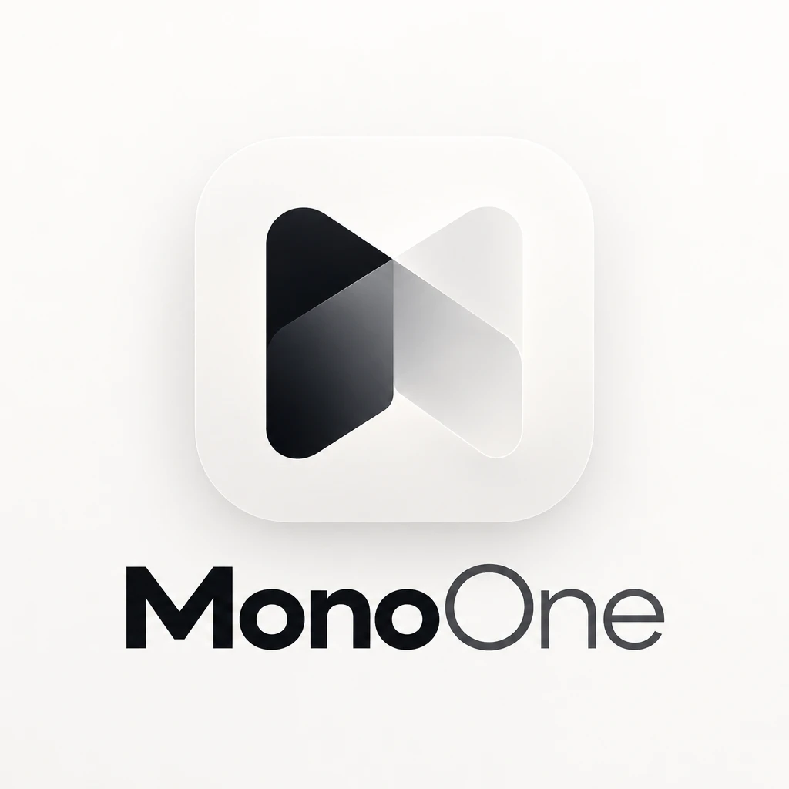
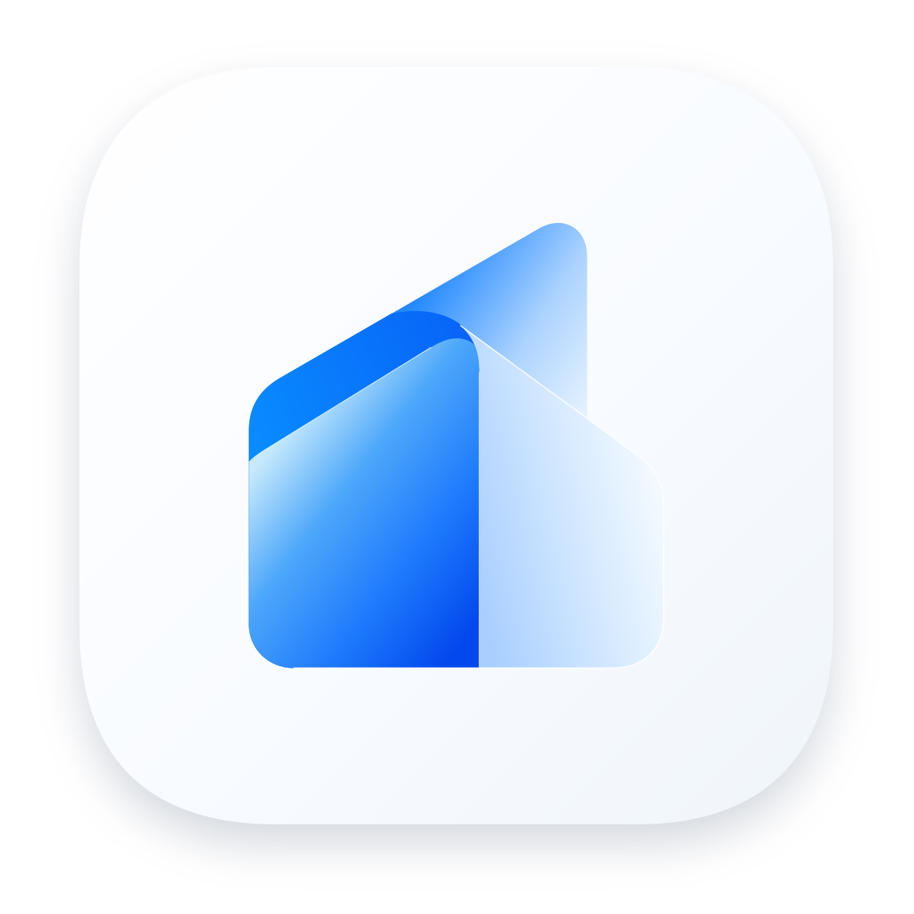

  

  <b>Small software, private by default.</b> 
  We build tools that keep your data on your device and leave you with files you own.

  <a href="https://monoone.dev"><b>monoone.dev</b></a> ·
  <a href="#indexone"><b>IndexOne</b></a> ·
  <a href="#rigone"><b>RigOne</b></a> ·
  <a href="#surface-one"><b>Surface One</b></a>

---

##  IndexOne

**Secure, local-first meeting notes for macOS.** IndexOne records your calls, transcribes them on
your Mac, writes a structured note you own as plain Markdown, and lets you ask questions during the
meeting and across everything you have ever recorded.

- 🎧 **Both sides of the call.** Your mic and the other side are recorded separately and merged into a Me / Others transcript.
- 🗣️ **On-device Whisper.** Transcription runs locally with Metal. There is no cloud transcription.
- 📝 **Notes you own.** Summary, decisions, action items and quotes, written into your Obsidian vault as `.md` files with `[[wikilinks]]`.
- 💬 **Answers with sources.** Ask mid-call or months later and see which meetings and notes each answer came from.
- 🔐 **Encrypted and lockable.** One encrypted database on your Mac, plus per-folder Touch ID locks.
- 🤖 **Your AI, your choice.** Use an on-device model or opt in to a cloud provider. A local, read-only MCP server lets your own agents read your notes.

Free during early access · macOS 13.4+ · Apple Silicon and Intel · no account needed 
[index-one.io](https://index-one.io) · [Download](https://github.com/monoone-dev/index-one-landing-page/releases/latest) · [Discussions](https://github.com/monoone-dev/index-one-landing-page/discussions)

##  RigOne

**A native macOS control room for coding agents.** Define an agent once, place it on a canvas,
connect the steps, and run the graph against a folder on your Mac. Claude Code and Codex are
first-class peers, independent branches run at the same time, and the evidence of a run outlives
the terminal it came from.

- 🧩 **Visual workflows.** Agent steps, commands, checks, loops and retries, saved as a graph you run again.
- ⚡ **Real parallel execution.** Independent branches overlap in time instead of queueing behind one worker.
- 👀 **A run you can read.** The plan on one side, what every agent said on the other, questions pinned.
- 🧾 **Evidence that lasts.** Receipts, handoffs and diagnostics stay after the output is gone.

Free · alpha · macOS 13+ · Apple Silicon · bring your own agent CLI 
[Website](https://monoone.dev/rig-one-landing-page/) · [Download](https://github.com/monoone-dev/rig-one-landing-page/releases/latest)

##  Surface One

**A design system and component library for any app.** Design tokens and skins ship as plain CSS,
with Angular components on top.

- 🎨 **Design tokens.** Framework-agnostic CSS: colors, type, spacing and self-hosted fonts.
- 🌗 **Three skins, five accents.** Studio, Paper and Minimalist, each in light and dark.
- 🧱 **Angular components.** Directive-first parts, one entry point per component.
- 🤖 **Made for AI assistants.** An MCP server with the components, their API and theme variables, plus agent skills for Claude, Codex and Copilot.

Free · beta · Angular 22 · docs in 9 languages 
[Documentation](https://monoone.dev/surface-one/) · [Source](https://github.com/monoone-dev/surface-one)

## Repositories

| Repository | What it holds |
| --- | --- |
| [**monoone-landing-page**](https://github.com/monoone-dev/monoone-landing-page) | The [monoone.dev](https://monoone.dev) website |
| [**index-one-landing-page**](https://github.com/monoone-dev/index-one-landing-page) | IndexOne's public home: DMG downloads and release notes, the [index-one.io](https://index-one.io) website, [user docs](https://index-one.io/docs.html), and the issue tracker |
| [**rig-one-landing-page**](https://github.com/monoone-dev/rig-one-landing-page) | RigOne's public home: downloads, release notes, the website and the issue tracker |
| [**surface-one**](https://github.com/monoone-dev/surface-one) | Surface One's source code, packages and documentation |

The IndexOne and RigOne app source code is not public.

## Get in touch

- **Bugs and ideas:** open an issue in the product's repository above, or start a [discussion](https://github.com/monoone-dev/index-one-landing-page/discussions).
- **Security:** see the [security policy](https://github.com/monoone-dev/.github/blob/main/SECURITY.md). Please do not report vulnerabilities in public issues.

🔒 local-first · 📁 files you own, no lock-in · 🍎 Mac and 🌐 web

